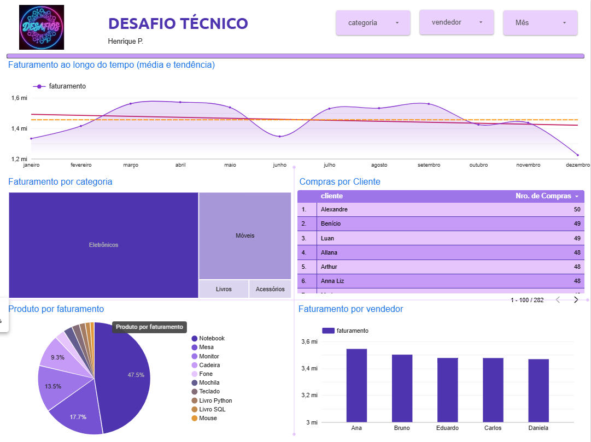

# Projeto de Análise de Dados de Vendas

Este projeto consiste em um pipeline de dados completo, desde o processamento inicial de arquivos brutos até a criação de um dashboard executivo interativo. O objetivo foi transformar dados de vendas em insights sobre performance de vendedores, produtos e comportamento de clientes.

## [Python passo a passo no notebook](Exercícios_py.ipynb)
## [Exercícios SQL](Exercícios.sql)
---

## Tecnologias Utilizadas

- **Python**: Processamento e limpeza de dados (Pandas)
- **SQL**: Estruturação e consultas analíticas
- **Looker Studio**: Visualização de dados e BI

---

## Etapas do Projeto

### 1. Processamento de Dados (Python)

Os dados brutos foram carregados e tratados:

```python
import pandas as pd

df = pd.read_csv('vendas_brutas.csv')
df['data_venda'] = pd.to_datetime(df['data_venda'])
df['faturamento'] = df['quantidade'] * df['preco_unitario']

df.to_csv('vendas_limpas.csv', index=False)
```

### 2. Análise Analítica (SQL)

Consultas foram realizadas direto no python, precisei criar um db e usar ele pra executar as queries com sqlite para validar métricas e preparar as tabelas que alimentariam o dashboard.

```
SELECT 
    vendedor, 
    SUM(faturamento) AS total_faturamento
FROM vendas
GROUP BY vendedor
ORDER BY total_faturamento DESC;
```

## 3. Visualização (Looker Studio)

O dashboard foi estruturado a partir do output csv do python para responder as seguintes perguntas de negócio:

- **Qual mês vende mais?**  
  *(Gráfico de linhas com comparação de período anterior)*

- **Qual vendedor vende mais?**  
  *(Gráfico de barras)*

- **Qual produto vende mais?**  
  *(Gráfico de pizza)*

- **Qual categoria vende mais?**  
  *(Mapa de árvore com percentual do total)*

- **Existe cliente que compra mais de uma vez?**  
  *(Tabela com contagem de registros por cliente)*

  link: [looker](https://lookerstudio.google.com/reporting/f3521849-cf46-4d2b-8622-105e905ac513/page/X3LtF)

  ## Visualizacao do Dashboard



---

## Funcionalidades do Dashboard

- **Filtros Interativos**  
  Dropdown para seleção de meses

- **Análise Temporal**  
  Gráfico de linha com indicadores de variação (setas de tendência)

- **Navegação**  
  Layout otimizado para visualização rápida de KPIs
